# frogcrew
## Documentation

### Project Use Cases

🔗 [Use Cases](https://docs.google.com/document/d/1MJMnPqx4qUBR0qFzSWv8anxSBLFR3iAOiIuMep46GxA/edit?usp=sharing)

### API Documentation

🔗 [API Documentation](https://app.swaggerhub.com/apis-docs/JAMESEDMONSON/frog-crew/1.0.0)

### UML Class Diagram

🔗 [UML Class Diagram](https://www.mermaidchart.com/raw/1f4be78a-0597-4fc4-8986-1ceb8937250e?theme=dark&version=v0.1&format=svg)

